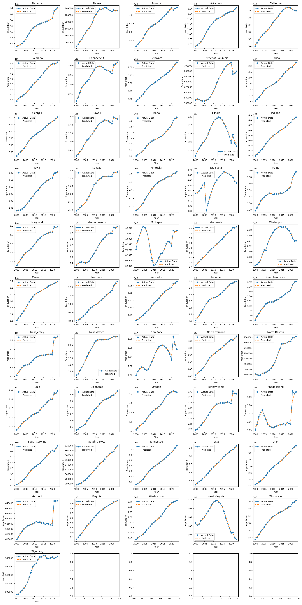
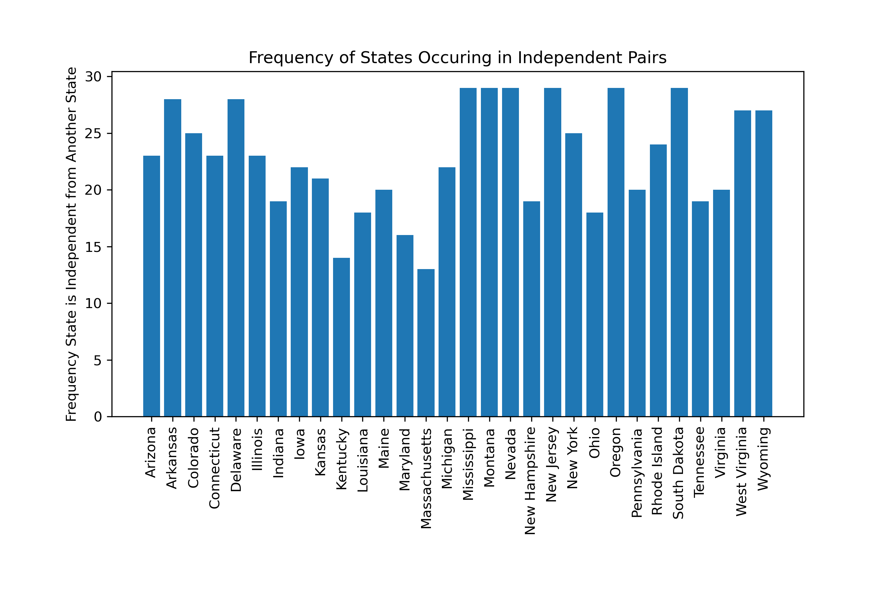

# Machine Learning Components

## Population Prediction
- Why did you use this statistical test or ML algorithm? Which other tests did you consider or evaluate? What metric(s) did you use to measure success or failure, and why did you use it? What challenges did you face evaluating the model? Did you have to clean or restructure your data?

We used `sklearn.ensemble.RandomForestRegressor`, information [here](https://www.geeksforgeeks.org/random-forest-regression-in-python/), to predict the population of every state in 2024, given the data from 2000-2023. We knew we wanted to use some sort of ensemble learning because population dynamics can have unexpected nuances that one type of model alone can't necessarily capture. Random Forest captures non-linear relationships which was what we wanted. It also prevents overfitting quite well. To evaluate the performance of each model (51, 1 per state including DC), we used `sklearn.model_selection.cross_val_score` to perform 5-fold cross-validation using `'r2'` scoring. We used r2 since it quantifies the percentage of the variance in the dependent variable (population) that is predictable from the independent variables (years). Most of the values were close to 0 or positive, indicating the models fit well. A visual of the models predictions compared to the actual values is below. 



Initially, we tried just using `sklearn.linear_model.LinearRegression` but the accuraccy was very low, with r2 values being very big negative numbers. This prompted the switch. 

I had to perform a pivot on the table to get the data in `X` `y` format to train a model. This wasn't too challenging thankfully. 

- What is your interpretation of the results? Do you accept or deny the hypothesis, or are you satisfied with your prediction accuracy? For prediction projects, we expect you to argue why you got the accuracy/success metric you have. Intuitively, how do you react to the results? Are you confident in the results?

Based on the figure above with the 51 plots, we are very confident in our models as we see the predicted data closely follows the actual data. Although there may be concerns of overfitting since the lines follow most of the same patterns, this is expected since we only have 23 data points for each model. Furthermore, we want the model to really learn each state's population trends for the most accurate 2024 prediction. 

- Did you find the results corresponded with your initial belief in the data? If yes/no, why do you think this was the case?

Yes! We expected the data to follow the same general trend and it did! We think this is because of the specific model we used -- as we can see in the figure above, it learned the shape of each state's population curve really well. 

- Do you believe the tools for analysis that you chose were appropriate? If yes/no, why or what method could have been used?

The tools were appropriate, as mentioned before, since the slight overfit of our model was expected given we only had 23 data points. We significantly improved the accuracy from just using a `LinearRegression` so clearly the model we chose was better. 

- Was the data adequate for your analysis? If not, what aspects of the data were problematic and how could you have remedied that?

Yes. We had data for 23 years that we used to predict just one year, which isn't unreasonable. It could have been improved by using even more past population data but this was difficult to find through the census. 

## Alcohol Prediction
- Why did you use this statistical test or ML algorithm? Which other tests did you consider or evaluate? What metric(s) did you use to measure success or failure, and why did you use it? What challenges did you face evaluating the model? Did you have to clean or restructure your data?

We used several different ML algorithms to determine the best one to use for each state. Specifically, `sklearn.linear_model.Lasso`, `sklearn.linear_model.Ridge`, `xgboost.XGBRegressor` and `sklearn.linear_model.ElasticNet`. In the interest of achieving the best results, we designed a general ML pipeline, and then ran several test using these models and hyperparameter tuning. The loss metric was mean squared error. Determining how to split up the problem was the most difficult part. Initially, we wanted to train one model where the states were a feature, but the models struggled with this. As a result, we decided to split the data and run several models. The data was split by state (51) and further by beverage type (3) resulting in 153 seperate dataframes. Then, the ML pipeline was used on all these dataframes, and the best model picked for each. Then the best models were used to predict the previous 3 years for each state for each beverage type.

- What is your interpretation of the results? Do you accept or deny the hypothesis, or are you satisfied with your prediction accuracy? For prediction projects, we expect you to argue why you got the accuracy/success metric you have. Intuitively, how do you react to the results? Are you confident in the results?

The results showed that alcohol consumption of all types increased in all states. We did not have a hypothesis test for this section, but we are satisfied with the predictions. We are confident in the results given the large amount of data and robust models utilized.

- Did you find the results corresponded with your initial belief in the data? If yes/no, why do you think this was the case?

The results matched with our prediction in that alcohol consumption in general increased. This could be the case for many reasons, but most likely it is due to most states experiencing population increases (specifically 21+ population) resulting in higher alcohol consumption overall.

- Do you believe the tools for analysis that you chose were appropriate? If yes/no, why or what method could have been used?

Yes, the tools for the analysis were approriate. We only had data from 1970-2020, but we needed to predict for 2022, 2023, and 2024. A linear regression model was best to learn based on the data and provide the most accurate predictions for the previous years.

- Was the data adequate for your analysis? If not, what aspects of the data were problematic and how could you have remedied that?

The data was completely adequate for the challenge. We essentially used all the data that is publicaly available and accurately tracked. This data was large enough to generate accurate predictions for the past 3 years. One thing to note is that this data did not include the Covid-19 years, which make have had a large impact on alcohol consumption.


# Hypothesis Testing

## `alc_bet_corr.py` - Alcohol and Betting Correlation
- Why did you use this statistical test or ML algorithm? Which other tests did you consider or evaluate? What metric(s) did you use to measure success or failure, and why did you use it? What challenges did you face evaluating the model? Did you have to clean or restructure your data?

We used `scipy.stats.spearmanr` since we had two columns whose correlation we wanted to determine. This is a classic statistical test to do so. We tested this on all pairs of 
1. `handle`
2. `hold`
3. `gross_revenue`

and 

1. `total_alcohol` (described below)
2. `beer`
3. `spirits`
4. `wine`

for each state (600 total tests ocurred).

 The metrics this test uses are the Pearson's correlation value and p-value. We considered a value of `p < 0.05` to be significant and a correlation of `r > 0.5` to be "strong." We didn't face too many challenges as we had planned a lot for this specific test (it was our intial research question). The only restructuring of data that was done in this stage was making a new column to represent the total alcohol sales using the following line of code:
```
all_data['total_alcohol'] = all_data['beer'] + all_data['spirits'] + all_data['wine'] # Calculate the total alcohol sales
```

- What is your interpretation of the results? Do you accept or deny the hypothesis, or are you satisfied with your prediction accuracy? For prediction projects, we expect you to argue why you got the accuracy/success metric you have. Intuitively, how do you react to the results? Are you confident in the results?

The results can be found in `figures/correlations.txt`. 

1. *Handle vs Total Alcohol, Handle vs Beer, Handle vs Spirits, Handle vs Wine*:
    - Maine and Massachusetts consistently show strong correlations between handle and various types of alcohol sales. This suggests a strong relationship between the amount of betting handle and the total alcohol sales as well as sales of specific types of alcohol in these states. The p-values indicate that these correlations are statistically significant. However, Maine only has three rows of data due to limited betting data. Because of this, we can't make the conclusion that the variables are correlated.
    - Given these findings, the hypothesis that there is a correlation between betting handle and alcohol sales is **rejected**. Significant correlations were only found for 2 states (1 if you don't count Maine), irregardless of the strength of the correlation. These variables don't seem to be correlated.
2. *Hold vs Total Alcohol, Hold vs Beer, Hold vs Spirits, Hold vs Wine*:
    - West Virginia shows a strong correlation between hold and total alcohol sales, suggesting a significant relationship between betting hold and total alcohol sales in this state. Additionally, Indiana, New Hampshire, and New York show weak but significant correlations.
    - The hypothesis that there is a correlation between betting hold and alcohol sales is **rejected**. Significant correlations were only found for 4 states, and 3 of them are weak correlations. 
3. *Gross Revenue vs Total Alcohol, Gross Revenue vs Beer, Gross Revenue vs Spirits, Gross Revenue vs Wine*:
    - Massachusetts shows strong correlations between gross revenue and total alcohol sales as well as sales of specific types of alcohol. This suggests a significant relationship between gross revenue and alcohol sales in this state.
    - The hypothesis that there is a correlation between gross revenue and alcohol sales in Massachusetts seems supported by the data. However, when generalizing this hypothesis to all states, we **reject** it. Only one state was found to have a statistically significant correlation.


We are pretty confident in the results due to the rigorous data cleaning and joining this dataset underwent and the reliability of our statistical test.

- Did you find the results corresponded with your initial belief in the data? If yes/no, why do you think this was the case?

No. We rejected all of our initial hypotheses. We believed that sports betting and alcohol would be correlated, but did not find that (aside from in Massachusetts). This is probably the case because sports betting peaks in months with big sports games, while drinking is a year-round activity that usually peaks in the holiday season. 

- Do you believe the tools for analysis that you chose were appropriate? If yes/no, why or what method could have been used?

Yes! Using Pearson's correlation to determine if there's a linear relationship between two variables is extremely appropriate. 

- Was the data adequate for your analysis? If not, what aspects of the data were problematic and how could you have remedied that?

The data came from a lot of different soures and was limited, especially the betting data, which was missing a lot of month data for certain states where sports betting was recently legalized. This study could be redone in several years when more data is available to further confirm the relationship between the variables. 

## Two `alc_percapita_ind` - Alcohol Consumption
- Why did you use this statistical test or ML algorithm? Which other tests did you consider or evaluate? What metric(s) did you use to measure success or failure, and why did you use it? What challenges did you face evaluating the model? Did you have to clean or restructure your data?

The data did not require much cleaning, but we did need to use two seperate tables from `data.db`, specifically, `alcohol_sales` and `population_month`. For this study we used `scipy.stats.ttest_ind`. Seperate t-test were coducted for each beverage type for each state pair, resulting in 7,650 t-test that were conducted. In each t-test, the per-capita rates were used, in order to account for the population differences between states. We used a relatively strict cutoff, where the p-value needed to be less than 0.01. Finally, to store the results, a dictionary was used to store the number of times a state appeared in a significantly different pair.

- What is your interpretation of the results? Do you accept or deny the hypothesis, or are you satisfied with your prediction accuracy? For prediction projects, we expect you to argue why you got the accuracy/success metric you have. Intuitively, how do you react to the results? Are you confident in the results?

The results can be found in `figures/state_alcohol_sig_count.png`. In general, most states were significantly different in their consumptipon more other states. The figure displays the number of significant differences each state was a part of, with 150 being the max possible amount. Some key findings are below:

1) Utah was a part of a significant difference in 148 comparisons. This indicates that Utah is very different from the rest of the nation.
2) Florida was part of the a significant difference in 107 comparisons. Florida tended to be the least significantly different between other states.

Initially, the results seemed incorrect. It was hard to beleieve that there were so many significant differences. Upon further inspection, the math was completely correct and the p-values accurately calculated. It seems that states, when broken down by beverage type, in general are significantly different from other states.

- Did you find the results corresponded with your initial belief in the data? If yes/no, why do you think this was the case?

No, the results did not correspond with my initial belief. We believed some states would show significant differences in alcohol consumption amounts per capita, but the results showed a majority of states differed with each other.

- Do you believe the tools for analysis that you chose were appropriate? If yes/no, why or what method could have been used?

Yes, the tool used for this analysis was approriate. We used `scipy.stats.ttest_ind` to conduct these tests. Since we wanted to compare the sample means when comparing two different states, a t-test made the most sense to use.

- Was the data adequate for your analysis? If not, what aspects of the data were problematic and how could you have remedied that?

The data was adequate for the analysis. For each ttest there were 25 points calculated by using data from reputable sources. This should be enough to conduct an accurate ttest. That being said, more data would help reinforce the results. In the future, it would be interesting to compare all the data we had (1970-2024) rather than limiting ourselves to recent trends.

## Three `handle_percapita_ind.py` - Independence of Bet Volume
- Why did you use this statistical test or ML algorithm? Which other tests did you consider or evaluate? What metric(s) did you use to measure success or failure, and why did you use it? What challenges did you face evaluating the model? Did you have to clean or restructure your data?

We wanted to know if betting volume is significantly different between states. We initially considered just directly comparing the betting volumes, but decided to calculate it per capita (since the volume of bets on its own wouldn't be comparable between a large state and a small state). So, the overall way this test was structured was to compare the betting volumes per capita of every month between pairs of states. If those monthly volumes were significantly different, we recorded that frequency per state.

The purpose of this test was exploration so we didn't need a metric of failure or success. We used a student t-test (from `scipy.stats`) to evaluate significance between. Just faced challenges with using the libraries. We did not have to restructure our data (we used `all_data` from `data.db`).

- What is your interpretation of the results? Do you accept or deny the hypothesis, or are you satisfied with your prediction accuracy? For prediction projects, we expect you to argue why you got the accuracy/success metric you have. Intuitively, how do you react to the results? Are you confident in the results?

We found that many more of the states were pairwise significantly different than we expected. 688 out of the 870 possible pairs were significantly different. Here is a bar chart of the results:



Some extreme values are Massachusetts and Kentucky which had less than 15 times they were significantly different. Also Mississippi, Montana, Nevada, New Jersey, Oregon, and South Dakota all were significantly different about 30 times.

- Did you find the results corresponded with your initial belief in the data? If yes/no, why do you think this was the case?

We ended up rejecting the null much more than we thought. We are pretty confident that we did it right from manually inspecting the values, they were very different, contrary to intuition.

- Do you believe the tools for analysis that you chose were appropriate? If yes/no, why or what method could have been used?

We believe the tools we used were appropriate. We were worried that since we were running 870 hypothesis tests on the same data, the chance that we see a result that has an expected frequency of 0.05 or less would be pretty high by chance. However, since we found so many tests to be significant, this does not seem to be a problem.

- Was the data adequate for your analysis? If not, what aspects of the data were problematic and how could you have remedied that?

Yes, the data was more than adequate for the analysis. We wish that we could have had data for all the states (we only had betting data for 30), and that we had more years in our data set. However, the data that we did have was more than enough.
