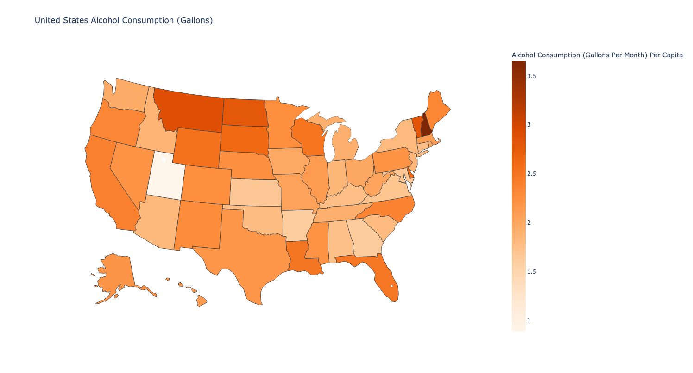
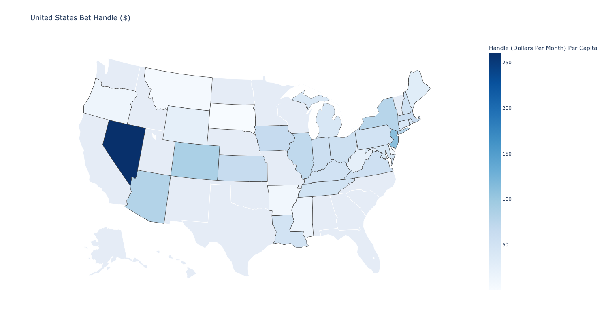
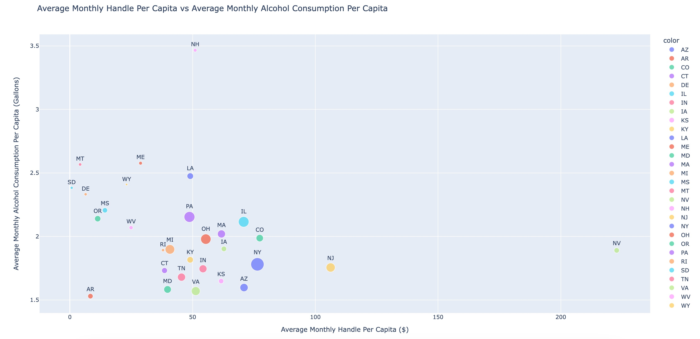
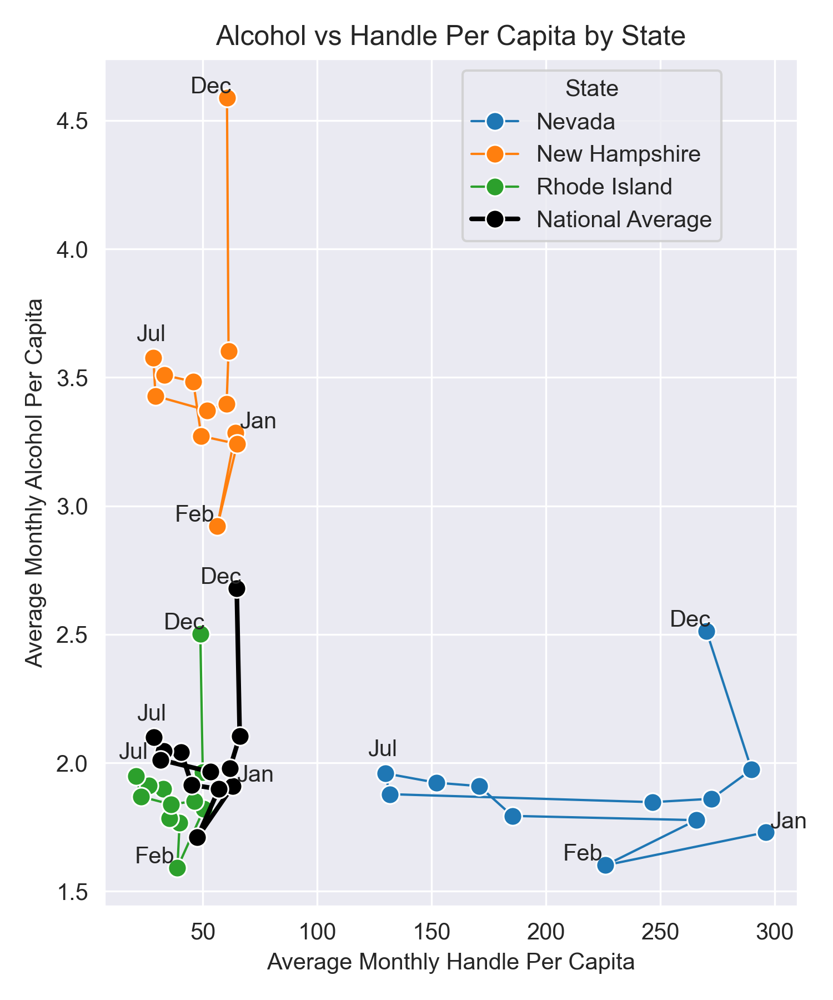

# Visualizations
- Why did you pick this representation? 
- What alternative ways might you communicate the result? 
- Were there any challenges visualizing the results, if so, what were they? 
- Will your visualization require text to provide context or is it standalone (either is fine, but it’s recognized which type your visualization is)?

## Heatmaps: `alc_heatmap.png` & `handle_heatmap.png`
 

We picked heatmaps since we had data stratified by state. We investigated whether there was a significant difference in alcohol consumption and bet handle between each pair of states, so this visualization was a great way to see our results manifest. We could have used a bar chart with states on the x-axis and the alcohol/handle on the y-axis. However, since the data is geographical, using a heatmap of the US is quite a cool visualization! We first attempted to use `geopandas` unsuccesfully and later switched to `plotly.express.chloropleth` to form the maps. The title and legend are sufficient to understand these visualizations. 

## `state_handle_alc.png`

We picked a scatter plot to illustrate the trends between average monthly alcohol consumption per capita and average monthly handle per capita of the states in our dataset. It allowed to use to visualize any correlation between the two areas. In addition, the size of the circle illustrated the population of the state. Another way to visualize this data would be a bar chart, where the bar width represents the average monthly handle per capita and the bar height represents the average monthly alcohol consumption per capita. This could be further expanded upon where the bar color represents the total population of a state. One of the challenges with our visualization was ensuring that the state identification was visible. We initially tried a legend, but with so many states it becomes difficult to identify which color belongs to which state. As a result, we opted to put the state 2 letter abbreviations on top of the points in the plot. The title, axis labels, and legend are sufficient to understand the visualization.

## `3state_handle_alc.png`

We picked a line plot to illustrate the changes in alcohol consumption and bet handle over the course of each year. It also allows us to compare how alcohol consumption and bet handle vary with and without each other. Another way to do this would've been four separate bar plots. However, it's much easier to compare each state and the national average in each metric (i.e., the "shape" of the line plot over the months and the distribution along handle and alcohol axes) in a line plot than a barplot. We could've also reported just the statistics, like the average change from November to December, but that would have been less visually appealing. Also, any small set of statistics we could have provided would have captured only some of the patterns the line plot displays. We initially started in `matplotlib,` but it looked bad. I can't quite describe why, but it seemed too basic and cluttered. So, we switched to `seaborn,` which looked much better. The title and legend are sufficient to understand these visualizations. We've also labeled some of the points directly to indicate their corresponding months.
